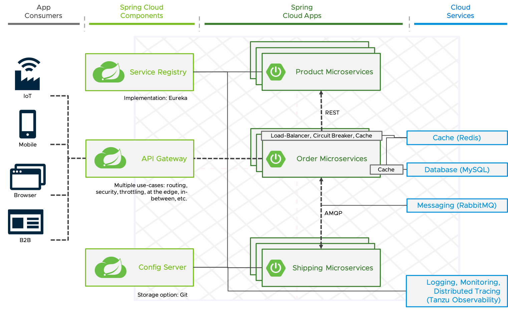

# Demo for a typical Spring Cloud Architecture on TAS/PCF/CF

**See repository [here](https://github.com/tsalm-pivotal/spring-cloud-demo-asc) for the same application deployed on Azure Spring Cloud**



## Deployment with Spring Cloud Service Broker

```
cf create-service p.mysql db-small mysql
cf create-service p.service-registry standard service-registry
cf create-service p.config-server standard config-server -c '{"git": { "uri": "https://github.com/tsalm-pivotal/spring-cloud-demo", "label": "main", "searchPaths": "config-server-configuration"} }'
cf create-service p.gateway standard gateway -c '{"host": "sc-gateway"}'
cf create-service p-rabbitmq standard rabbit-mq
cf create-service p-redis shared-vm redis

./mvnw clean package
cf push -f manifest-without-gateway-app.yaml

cf add-network-policy sc-order-service sc-product-service --protocol tcp --port 8080
```

## Deployment with Spring Cloud Service Broker using your own Spring Cloud Gateway application
```
cf create-service p.mysql db-small mysql
cf create-service p.service-registry standard service-registry
cf create-service p.config-server standard config-server -c '{"git": { "uri": "https://github.com/tsalm-pivotal/spring-cloud-demo", "label": "main", "searchPaths": "config-server-configuration"} }'
cf create-service p-rabbitmq standard rabbit-mq
cf create-service p-redis shared-vm redis

./mvnw clean package
cf push

cf add-network-policy sc-gateway sc-order-service --protocol tcp --port 8080
cf add-network-policy sc-order-service sc-product-service --protocol tcp --port 8080
cf add-network-policy sc-gateway sc-product-service --protocol tcp --port 8080
```

See information [here](gateway/README.md) if the gateway deployment doesn't work!

## API usage  
- Fetch products:
	```
	curl https://sc-gateway.YOUR_DOMAIN/SC-PRODUCT-SERVICE/api/v1/products
	```
- Fetch orders:
	```
	curl https://sc-gateway.YOUR_DOMAIN/SC-ORDER-SERVICE/api/v1/orders
	```
- Create order (After 10 seconds the status of the order should be DELIVERED)
	```
	curl --header "Content-Type: application/json" --request POST \
	  --data '{"productId":1,"shippingAddress":"Test address"}' \
	  https://sc-gateway.YOUR_DOMAIN/SC-ORDER-SERVICE/api/v1/orders
	```
 
